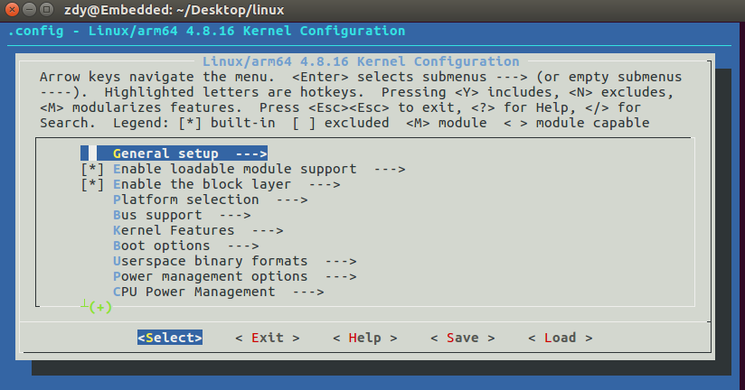

# 基于树莓派的可视频监控远程开门器

- **小组名称：** 金六福（Kinliufook）
- **小组成员：** 赵东宇 于乐 刘玄 孔思琦 穆柳允 李广宇
- **小组简介：** 《嵌入式软件开发技术与工具》2019课程项目小组，但愿 **金六福** 这个福气满满的名字能保佑我们六小只进展顺利，远离bug。

---

## 一、开发环境

### 1.1 执行环境(Execution Environment)

目标平台的硬件环境

#### Host端

    一台PC(Linux操作系统 或 装有Linux操作系统虚拟机)

#### Target端

    Raspberry Pi 3B

树莓派是一款基于ARM的微型电脑主板，以SD/MicroSD卡为内存硬盘，卡片主板周围有1/2/4个USB接口和一个10/100以太网接口，可连接键盘、鼠标和网线，同时拥有视频模拟信号的电视输出接口和HDMI高清视频输出接口，以上部件全部整合在一张仅比信用卡稍大的主板上，具备PC的所有基本功能。

> (图片来源:Raspberry Pi User Guide 4th Edition)

- 树莓派3B参数表

| 树莓派型号 | Raspberry Pi 3B |
| :---: | :--- |
| SOC | Broadcom BCM2837 |
| CPU | Cortex-A53 64Bit Soc at 1.2GHz |
| GPU | Broadcom VideoCore IV，OpenGL ES 2.0,1080p 30 h.264/MPEG-4 AVC高清解码器 |
| 内存 | 1GB SDRAM @ 400MHz (LPDDR2) |
| 板载资源 | Sandisk Micro SD card 16GB class 10 (ours) |
| 蓝牙 | Bluetooth 4.1/Bluetooth Low Energy(BLE) |
| 无线网络 | 802.11.b/g/n wireless LAN |
| 以太网网口 | Ethernet over USB 2.0(max. throughput 100Mbps) |
| USB | 4x USB Ports |
| GPIO | 40 pins |
| 音频接口 | 3.5mm插孔，HDMI电子输出或IIS |
| 视频接口 | Full Size HDMI, MIPI DSI display port, MIPI CSI camera port |
| 电源输入 | 5V/2.5A DC via micro USB or GPIO |
| 重量 | 45g |
| 总体尺寸 | 85 x 56 x 17mm |
| 工作环境温度 | 0-50℃ |
| 操作系统 | Debian GNU/Linux、 Fedora、 Arch Linux 、 RISC OS、 Windows10 IoT |

- **关于GPU的分配：**

	1GB内存要用于Broadcom BCM2837上的中央处理器（CPU）和图形处理器（GPU），因此要在两者之间合理分配内存。默认情况下GPU占64M，剩下全部用于CPU。如果将树莓派用作文件服务器或Web服务器，不需要使用视频输出，可以减少分配给GPU的内存数量(最少为16MB);如果用它来浏览网页，看B站甚至运行3D游戏，那么应该为GPU分配较大的内存，从而提高GPU性能，使其更好地渲染3D游戏画面;如果需要接入摄像头，则至少要为要为GPU分配128MB显存。

### 1.2 运行环境(Run-Time Environment)

目标平台上为运行嵌入式软件而必须的的软件环境。

#### 1.2.1 启动代码(Start-up code)
首先，需要知道的是树莓派不像传统的desktop computer那样启动。VideoCore（a.k.a the Graphics processor）实际上是在ARM CPU之前启动的！

树莓派的SOC内部集成了ARM CPU，GPU，ROM，SDRAM，以及其他设备，所以可以把SoC想象成主板和CPU一起压缩成一个芯片(arm系统结构的PC)。

- 当给树莓派加电后，最先执行保存在ROM中的代码，这些代码是芯片出厂的时候就设定的，通常被称为 **first-stage bootloader**，这些代码固化硬件内部，可以认为是SoC硬件的一部分。
first-stage bootloader的主要工作是**加载位于SD卡上第一个分区的bootloader**（称为second-stage bootloader ），第一个分区必须是FAT32格式。

- **second-stage bootloader** 主要是bootloader.bin。可以把SD卡取出，放到Windows或Linux系统中，就可以看到bootloader.bin文件。需要说明的是，上电或者重启后，cpu和ram都没有初始化，因此，执行second-stage bootloader 的实体是**GPU**，bootcode.bin是加载到GPU的128KB大小的L2Cache中，再执行的。
bootcode.bin的主要工作是**初始化ram，并把start.elf（也位于SD卡的第一分区）加载到内存中**。

- start.elf就是**third-stage bootloader**，start.efl从第一个分区中**加载config.txt**，可以把config.txt想象成bios配置信息，内部的配置都可以改变。
start.elf把ram空间划分为2部分：CPU访问空间和GPU访问空间。
SoC芯片只访问属于GPU地址空间的内存区，例如，GPU的物理内存地址空间为0x000F000 – 0x0000FFFF，CPU的物理内存地址空间为0x00000000 – 0x0000EFFF，如果GPU访问0x0000008，那么它访问的物理地址为0x000F008。（实际上，ARM处理器的mmu部件把GPU的内存空间映射到0xC0000000 开始）。

- config.txt在内存地址空间分配完成后才加载，因此，不可以在config.txt中更改内存地址的配置。然而，可以通过配置多个elf文件来让start.elf和config.txt支持多种配置空间。start.elf还从SD卡的第一个分区中加载cmdline.txt（如果cmdline.txt存在的话）。该文件保存的是启动kernel（不一定是Linux的内核）的参数。

- 至此，SoC进入了boot的最后阶段，start.efl把kernel.img，ramdisk，dtb**加载到内存的预定地址**，然后**向cpu发出重启信号**，因此cpu就可以从内存的预定地址执行kernel的代码，就进入了软件定义的系统启动流程。

启动操作系统后，GPU代码没有unloaded。事实上,start.elf不仅仅是GPU的固件，它还是一个专有的操作系统，叫做VideoCore OS。当普通OS (Linux)需要一个不能直接访问的元素时，Linux使用邮箱消息系统与VCOS通信。

>[Reference:How the Raspberry Pi boots up](https://thekandyancode.wordpress.com/2013/09/21/how-the-raspberry-pi-boots-up/)

#### 1.2.2 依赖库(Run-time libraries)
- printf()

- (待添加)

#### 1.2.3 操作系统(Embedded Operating System)

| 树莓派操作系统 | 简介 |
| :---: | :--- |
| Raspbian Stretch with Desktop | 基于Debian,Arm版的Linux系统,兼容性和性能优秀，当前实用最广泛的操作系统 |
| Raspbian Stretch with Desktop and recommended software | 相比上一个多了一些推荐软件，比如一些IDE、Office、游戏等 |
| Raspbian Stretch Lite | 基于Debian,不带图形界面，相比第一个小很多，4G内存卡就够 |
| Pidora | 基于Fedora，是拥有另一种风格的树莓派操作系统 |
| Arch Linux ARM | 基于Arch Linux，对linux操作系统很熟悉的人大都实用此版本 |
| Raspbmc | 在Raspbian基础上定制的XBMC影音播放系统，将树莓派设置成电视机的Linux操作系统 |
| OpenELEC | NOOBS安装推荐版本之一，用得最多的XBMC跨平台分支，是一个小的XBMC媒体操作系统 |
| Windows10 IoT | 微软官方针对物联网（IoT）的一个Windows版本 |
| Ubuntu MATE | 针对树莓派的版本，界面个性美观 |
| Snappy Ubuntu Core | 针对物联网(IoT)的一个发行版本 |
| CentOS | 针对ARM的发行版,基于Red Hat Linux ,CentOS 是RHEL（Red Hat Enterprise Linux）源代码再编译的产物，而且在RHEL的基础上修正了不少已知的 Bug ，稳定性值得信赖 |
| FreeBSD | 针对树莓派的发行版,由于FreeBSD宽松的法律条款，其代码被好多其他系统借鉴包括苹果公司的OS X，正是由于OS X的UNIX兼容性，使得OS X获得了UNIX商标认证。 |
| Kali | 针对树莓派的发行版，Kali Linux面向专业的渗透测试和安全审计,黑客的最爱 |

#### 1.2.4 中间件(Middleware)

- MQTT协议

	MQTT(MQ Telemetry Transport) 消息队列遥测传输协议是IBM开发的一种网络应用层的协议，提供轻量级的，支持可发布/可订阅的的消息推送模式，使设备对设备之间的短消息通信变得简单，比如现在应用广泛的低功耗传感器，手机、嵌入式计算机、微型控制器，卫星等移动设备。

>[Reference:MQTT协议优缺点及其实现](https://www.cnblogs.com/carterslam/p/9274417.html)

- (待添加)

### 1.3 编程环境(Programming Environment)

为完成嵌入式软件开发而必须的软硬件工具。

#### 1.3.1 文本编辑器：vi/vim，gedit,nano

- nano(小白最爱)

	nano是一个小巧自由，并且友好的编辑器，在大部分linux上都有nano命令。相对vi，不熟悉linux的话nano比较简单,只需要知道如何进入编辑，如何保存退出即可。

- vi(标准)

	vi编辑器是所有Unix及Linux系统下标准的编辑器，他就相当于windows系统中的记事本一样。对Unix及Linux系统的任何版本，vi编辑器是完全相同的，学会它后，您将在Linux的世界里畅行无阻。

- vim(编程最爱)
	Vim是一个类似于Vi的著名的功能强大、高度可定制的文本编辑器，在Vi的基础上改进和增加了很多特性。代码补全、编译及错误跳转等方便编程的功能特别丰富，在程序员中被广泛使用，和Emacs并列成为类Unix系统用户最喜欢的文本编辑器。

	安装vim只需要以下两步操作

	卸载vim-tiny：$ sudo apt-get remove vim-common

	安装vim full：$ sudo apt-get install vim

- gedit(纯文本)

	是Linux下的一个纯文本编辑器,但你也可以把它用来当成是一个集成开发环境 (IDE), 它会根据不同的语言高亮显现关键字和标识符。十分的简单易用，有良好的语法高亮，对中文支持很好，支持包括gb2312、gbk在内的多种字符编码。

#### 1.3.2 交叉编译工具：gcc  

- GCC（GNU Compiler Collection，GNU编译器套件），是由 GNU开发的编程语言编译器。它是以GPL许可证所发行的自由软件，也是 GNU计划的关键部分。

- 树莓派中已经安装了gcc工具链，可在树莓派中直接编译源代码生成可执行文件。与此同时，PC机上也可使用gcc工具链生成可执行代码，但是和树莓派上的gcc工具不同，PC机上的gcc工具生成intel或amd芯片上可执行的代码，但树莓派却是arm系列的芯片，显然存在不小的差异。那么使用交叉工具链便可在PC机上开发树莓派中可执行程序。 虽然树莓派的主频可达700MHz远高于一般的嵌入式系统，但相比于PC机其性能还是差些，使用交叉工具链可节约开发时间。在编译链接同等规模的代码时，PC机所用的时间应少于树莓派所用时间，通过交叉编译的方法提高效率。

#### 1.3.3 交叉调试工具：gdb/gdbserver

GDB是GNU开源组织发布的一个强大的UNIX下的程序调试工具。在UNIX平台下做软件，GDB这个调试工具有比VC、BCB的图形化调试器更强大的功能。

一般来说，GDB主要帮忙完成下面四个方面的功能：
- 启动程序，可以按照自定义的要求随心所欲的运行程序。
- 可让被调试的程序在你所指定的调置的断点处停住。（断点可以是条件表达式）
- 当程序被停住时，可以检查此时程序中所发生的事。
- 动态的改变程序的执行环境。

---

## 二、需求分析

### 2.1 引言

- **项目名称:** 基于树莓派的可视频监控远程开门器

- **背景：** 假设在一个周末的早上，你在宿舍懒洋洋的不想起床，这时候有人敲门 —— 门外是谁？我想见Ta吗？要去开门吗？不想起床怎么办？—— 我要是能看到门外是谁并且能够遥控门自动打开就好了

- **项目说明：** 本项目基于树莓派完成可视频监控的远程开门器。树莓派通过摄像头捕获门外画面，用户可通过手机连接同一个局域网看到门外实时画面，并通过手机按钮来控制树莓派发出指令，实现开门动作。

- **产品远景：** 本项目所做内容可进一步完善，实现家庭监控、工厂监控等，并能实现远程遥控进行某种操作。

- **参考资料：**

    ` [1]付珊珊.基于ARM的智能家居管理终端的研究与实现[D]．合肥：安徽理工大学,2014`

    ` [2]刘凌,刘琦,陈凯.基于物联网的智能家居软件系统研究[J].微型电脑应用.2018,34(10):16-18,25`

    ` [3]顾亚文.基于MQTT协议的通用智能家居系统设计与实现[D].西安电子科技大学,2014. `

### 2.2 系统功能分析

系统功能是系统与环境在相互作用中所表现出的能力，即系统对外部表现出的作用、效用、效能或目的。它体现了一个系统与外部环境进行物质、能量、信息交换的关系，即从环境接受物质、能量、信息，经过系统转换，向环境输出新的物质、能量、信息的能力。
#### 2.2.1 系统功能概述

| 编号 | 功能名称 | 功能描述 |
| :---: |:---: | :--- |
| Func-001 | 视频监控 | 通过门外的摄像头进行监控，可通过手机端实时查看门外情况 |
| Func-002 | 网络连接 | 树莓派与手机连接同一局域网，进行数据的传送 |
| Func-003 | 控制开门 | 通过手机或继电器控制树莓派进行开门 |
| Func-004 | 识别来访者 | 通过射频模块识别来访者 |

#### 2.2.2 系统功能分析

-主要功能模块是视频监控和开门控制。

1.视频监控模块
-主要通过USB网络摄像头，通过HTTP的方式访问linux上面的兼容摄像头，从而做到远程视频传输的效果。

2.开门控制模块
-树莓派接收到开门信号后，通过产生PWM波控制舵机转动，进而牵动门的插销实现开门动作，或者通过开关量实现继电器的控制，从而控制门的锁状态。后期可添加功能：不仅仅实现手机控制，也可以加入无线射频，通过刷卡或者刷手机NFC或者刷小米手环进门

- 系统用例图

- 系统外部事件表

| 编号 | 事件 | 描述 | 方向 | 到达模式 | 相应性能 |
| :---: | :--- | :--- | :--- | :--- | :--- |
| 1 | 用户屏幕命令 | 用户通过按钮或者点击事件选择功能 | 到客户端 | 偶发性 | <100ms的响应 | 
| 2 | 用户光标移动 | 用户通过指向设备移动光标 | 到客户端 | 偶发性 | <5ms的响应 | 
| 3 | 摄像头监控 | 利用摄像头实时的对门外情况进行监控 | 到系统 | 周期性 | 以5s为周期 | 
| 5 | 来访者出现 | 射频模块检测识别门外用户 | 到系统 | 偶发性 | <200ms的响应 | 
| 6 | 控制打开门 | 控制舵机实现打开插销动作 | 到系统 | 偶发性 | <500ms的响应 | 

- 系统顺序图  

场景一：通过摄像头感知外部环境变化，控制中枢进行数据处理、决策判断，对门进行控制操作。

### 2.3 系统总体设计

#### 2.3.1 系统场景图

#### 2.3.2 系统结构图

### 2.4 硬件需求

#### 硬件功能要求

| 编号 | 名称 | 描述 |
| :---: | :--- | :--- |
| HWREQ-Func-001 | 画面捕获 | 使用摄像头实现捕获画面功能，捕获480p分辨率画面 |
| HWREQ-Func-002 | 控制开门 | 控制舵机实现打开插销动作，堵转扭矩不低于10KG/cm |
| HWREQ-Func-003 | 射频识别 | 通过射频模块识别门外用户，响应时间不高于200ms |
| HWREQ-Func-004 | WiFi通信 | 可以使用WiFi进行局域网的通信 |
| HWREQ-Func-005 | 指令传输 | 要求实时性，响应时间不超过0.5秒 |

#### 硬件非功能性要求

| 编号 | 名称 | 概述 |
| :---: | :--- | :--- |
| HWREQ-NFunc-001 | 时间特性要求 | 要求硬件的响应时间、 更新处理时间、 数据的转换和传送时间以及其他时间达到要求 |
| HWREQ-NFunc-002 | 较高的可依赖性 | 要求硬件有较高的可依赖性，即较高的可靠性、可用性、保险性和安全性 |
| HWREQ-NFunc-003 | 性价比 | 性价比要高，保证质量精度的情况下，价格尽量低 |
| HWREQ-NFunc-004 | 功耗 | 满足处理速度和质量的情况下，功耗尽可能的低 |

### 2.5 软件需求

#### 软件功能要求

| 功能编号 | 功能名称 | 概述 |
| :---: | :--- | :--- |
| Func-001 | 实时显示视频 | 当有人按门铃时，或者敲门时，使用者打开APP，APP上可以实时显示门外画面 |
| Func-002 | 按钮远程控制 | 当确认情况后，可以点击APP上的相关按钮控制门的开闭情况 |
| Func-003 | 其他功能 | 备注：除主功能需求后续可能根据需求添加其他的功能 |

#### 软件非功能性要求

| 编号 | 功能名称 | 概述 |
| :---: | :--- | :--- |
| NFunc-001 | 系统可靠性 | APP在非跨度大的系统版本下可靠,APP会及时根据系统版本进行更新。 |
| NFunc-002 | 性能 | 响应时间在0.1s内;视频显示清晰:360P以上 |
| NFunc-003 | 安全性 | 视频等相应信息的保密性 |
| NFunc-004 | 运行环境 | Android和IOS各版本系统 |
| NFunc-005 | 易用性需求 | 界面功能清晰，易上手 |

### 2.6 系统接口定义

#### 接口说明

- 接口适用于系统内部软硬件模块的接口，连接两个功能相对独立却彼此联系的功能模块，以保证系统的完整性、统一性以及健壮性。

**接口（硬件类接口）** 是指同一计算机不同功能层之间的通信规则称为接口。 

**接口（软件类接口）** 是指对协定进行定义的引用类型。其他类型实现接口，以保证它们支持某些操作。

为了保证系统的完整性和健壮性，系统接口应满足下列基本要求：
- 接口应实现对外部系统的接入提供企业级的支持，在系统的高并发和大容量的基础上提供安全可靠的接入；
- 提供完善的信息安全机制，以实现对信息的全面保护，保证系统的正常运行，应防止大量访问，以及大量占用资源的情况发生，保证系统的健壮性；
- 提供有效的系统的可监控机制，使得接口的运行情况可监控，便于及时发现错误及排除故障；
- 保证在充分利用系统资源的前提下，实现系统平滑的移植和扩展，同时在系统并发增加时提供系统资源的动态扩展，以保证系统的稳定性；
- 在进行扩容、新业务扩展时，应能提供快速、方便和准确的实现方式.

本系统的主要接口有USB接口、数字I/O接口、UART接口、WIFI接口。主要的协议有：http协议、WiFi协议、MQTT协议、Linux系统协议、Android开发基本库、python脚本库、Mjpg-Streamer（开源）。

#### 接口定义

- 硬件接口

| 模块 | 接口 | 功能 |
| :---: | :--- | :--- |
| 树莓派 | USB、UART、WIFI、数字I/O、| 与各模块通信，发送接收数据。 |
| 摄像头 | USB接口 | 捕获门外视频信息 |
| 舵机 | 数字I/O接口 | 带动插销实现开门控制 |
| RFID模块 | UART接口 | 门外的人通过刷卡（比如射频卡、手机、小米手环等）开门 |

- 软件接口

| 模块 | 接口(协议) |
| :---: | :--- |
| 树莓派与手机间传输画面 | http协议 |
| 树莓派与路由器传输 | WiFi协议 |
| 树莓派与手机间发送指令 | [MQTT协议]() |
| 树莓派与摄像头通信 | USB协议 |
| 树莓派与RFID通信 | 详见[40505W-M通讯协议]() |
| 其他依赖库 | Linux系统协议、Android开发基本库、python脚本库、Mjpg-Streamer（开源） |

---

## 三、构建目标系统

### 3.1 配置Linux内核

准备Linux系统,我的为虚拟机安装 **ubuntu 16.04 LTS** 系统

#### 3.1.1 更新系统源

	`sudo apt-get update`

---

 这一步我出现了`E: Could not get lock /var/lib/apt/lists/lock - open`的情况，网络上有说删掉`/var/lib/apt/lists/lock`就好，这种方法比较暴力。

出现这个问题的原因可能是有另外一个程序正在运行，导致**资源被锁不可用**。而导致资源被锁的原因，可能是上次安装时没正常完成，而导致出现此状况。

解决方法：

①查看进程`ps -e | grep apt`

②杀死进程`sudo kill apt`(杀死apt相关的)

---

#### 3.1.2 安装必要的工具库 **aarch64交叉编译器**

	sudo apt-get install -y bc build-essential gcc-aarch64-linux-gnu git unzip

aarch64是ARMv8 架构的一种执行状态。AArch64 不是一个单纯的 32 位 ARM 构架扩展，而是 ARMv8 内全新的构架，完全使用全新的 A64 指令集。  
>[Reference:AArch64是什么](https://blog.csdn.net/rd_w_csdn/article/details/53841018)

#### 3.1.3 安装配置系统内核包

	sudo apt-get install kernel-package

如果想把内核镜像做成一个deb包来用，那么必须用安装这个包了。

Deb是Debian软件包格式，文件扩展名为.deb，deb包是Unixar的标准归档，将包文件信息以及包内容，经过gzip和tar打包而成，处理deb包的经典程序是dpkg，经常是通过apt来运作。

#### 3.1.4 安装配置内核menuconfig的辅助工具

	sudo apt-get install libncurses5-dev

这一步是为了能够后面的 `make menuconfig`

#### 3.1.5 下载Raspberry Linux内核

	git clone --depth=1 -b rpi-4.8.y https://github.com/raspberrypi/linux.git

这里下载4.8版本.个人认为最后可以通过查看内核版本的方式确认是否更换内核

对当前的树莓派查看版本,打印输出显示为当前为4.14版本

	pi@raspberrypi:~ $ uname -a
	Linux raspberrypi 4.14.98-v7+ #1200 SMP Tue Feb 12 20:27:48 GMT 2019 armv7l GNU/Linux

### 3.2 编译安装内核、模块及dtbs设备树

#### 3.2.1 生成一个默认的配置文件.config

cd至git clone的linux文件夹，执行命令

	make ARCH=arm64 CROSS_COMPILE=aarch64-linux-gnu- bcmrpi3_defconfig

这个过程很快，结果显示

	configuration written to .config

其中，bcmrpi3_defconfig 这个文件位于`/Home/Desktop/linux/arch/arm64/configs`

这个位置里面还有一个defconfig文件，如果不用接下来的方法去配置，也可以直接修改这里的配置文件。

#### 3.3.2 指定编译器进行内核编译

	make ARCH=arm64 CROSS_COMPILE=aarch64-linux-gnu-  -j 4

跑了34分钟电脑烫得严重，庆幸当时配虚拟机还算是给了4个核而不是1个，否则应该需要更久。

编译好的内核位于`/Home/Desktop/linux/arch/arm64/boot`,有个image文件，Type为**DOS/Windows executable (application/x-ms-dos-executable)**，大小为**9.5 MB (9,525,248 bytes)**

#### 3.3.3 打开配置菜单

如果需要自己配置内核，则需要使用 menuconfig 配置新内核的功能

输入`make ARCH=arm64 CROSS_COMPILE=aarch64-linux-gnu- menuconfig`，显示如下界面：

在menuconfig中对内核配置中的选项进行裁剪(点空格，进行选择)。

#### 3.3.4 裁剪内核

- **General setup  --->   Configure standard kernel features (expert users) ---> Enable 16-bit UID system calls**

	启用16位UID。系统模式使用的UID是32位

- **General setup  --->   Configure standard kernel features (expert users) ---> Sysfs syscall support**

	sys_sysfs系统调用已不再被libc支持.选"N"以减小内核尺寸.

- **Networking support  ---> Bluetooth subsystem support**

	目前来看用不到蓝牙，故而裁剪掉。

- **Networking support  ---> NFC subsystem support**

	尽管我们小组后期有可能用NFC，但是打算的是用NFC模块，用的是串口通信，故而NFC协议估计也用不到。

- **Networking support ---> Amateur Radio support**  

	应该和电台没啥关系吧，裁掉

- **Networking support ---> CAN bus subsystem support**

	工业上用的好像比较多，没怎么用过，这次也不会用，裁掉

- **Device Drivers  --->  Character devices  ---> Support for console on virtual terminal**

	取消树莓派的开机提示打印信息

- **Device Drivers  ---> SPI support**

	想了想没有用到SPI的地方，裁掉。

---
后来在编译内核时会遇到以下错误，看样子声音用到了SPI，故而放弃裁剪SPI。

	ERROR: "spi_setup" [sound/soc/bcm/snd-soc-pisound.ko] undefined!
	ERROR: "spi_bus_type" [sound/soc/bcm/snd-soc-pisound.ko] undefined!
	ERROR: "spi_sync" [sound/soc/bcm/snd-soc-pisound.ko] undefined!

---

- **Device driver ---> Generic Driver Options ---> Fallback user-helper invocation for firmware loading**

	在内核自己直接加载固件失败后,作为补救措施,调用用户空间帮助程序(通常是udev)再次尝试加载.通常这个动作是不必要的

- **Device Drivers  ---> Memory Technology Device (MTD) support** 

	MTD子系统是一个闪存转换层.其主要目的是提供一个介于闪存硬件驱动程序与高级应用程序之间的抽象层,以简化闪存设备的驱动.注意:MTD常用于嵌入式系统,而我们常见的U盘/MMC卡/SD卡/CF卡等移动存储设备以及固态硬盘(SSD),虽然也叫"flash",但它们并不是使用MTD技术的存储器.仅在你需要使用主设备号为31的MTD块设备(/dev/romX,/dev/rromX,/dev/flashX,/dev/rflashX),或者主设备号为90的MTD字符设备(/dev/mtdX,/dev/mtdrX)时选"Y",否则选"N".

---

#### 3.3.5 编译内核

	make ARCH=arm64 CROSS_COMPILE=aarch64-linux-gnu-  -j 4

内核裁剪后编译内核，这次生成的内核大小为**4.3 MB (4,329,472 bytes)**，相比之前的9.5 MB少了一半多。

将新内核安装到镜像文件系统中，需要以下几步，

- 第一步，挂在官方提供的img镜像文件到Ubuntu系统中，
- 第二步，替换原来的系统内核，
- 第三步，安装内核以及模块并配置boot启动为新编译的内核。

#### 3.3.6 挂载img镜像文件

在img镜像文件的位置打开终端，查看当前树莓派系统的详细信息，便于后面我们挂载到 /mnt 上

查看当前这个镜像文件的img区块位置sudo fdisk -l 2018-11-13-raspbian-stretch.img

打印的信息为：

	Disk 2018-11-13-raspbian-stretch.img: 3.2 GiB, 3405774848 bytes, 6651904 sectors
	Units: sectors of 1 * 512 = 512 bytes
	Sector size (logical/physical): 512 bytes / 512 bytes
	I/O size (minimum/optimal): 512 bytes / 512 bytes
	Disklabel type: dos
	Disk identifier: 0x025ce4e3

| Device | Boot Start | End | Sectors | Size | Id | Type |
| :---: | ---: | ---: | ---: | ---: | ---: | ---: |
| 2018-11-13-raspbian-stretch.img1 | 8192 | 98045 | 89854 | 43.9M | c | W95 FAT32 (LBA) |
| 2018-11-13-raspbian-stretch.img2 | 98304 | 6651903 | 6553600 | 3.1G | 83 | Linux |

其中的起点，末尾，扇区的值需要留心观察，接下来会用于计算挂载的地址偏移量。

可以看到它有两个分区。第一个是启动分区，它主要包含了 bootloader、Linux 内核以及少量配置文件。第二个是根分区。
我们可以在我们的文件系统上挂载这些分区——

从**根分区**开始：
	sudo mount -o loop,offset=50331648 2018-11-13-raspbian-stretch.img /mnt
	其中，根分区offset = 98304 * 512 = 50331648

-o 是mount命令的一个参数，Options的首字母

loop：用来把一个文件当成硬盘分区mount到目录

接着是**启动分区**：
	sudo mount -o loop,offset=4194304,sizelimit=46005248 2018-11-13-raspbian-stretch.img /mnt/boot
	其中，offset ：4194304 = 512 * 8192，sizelimit：46005248 = 512 * 89854

- 到此，系统原生自带的img镜像就全部挂载到了的Ubuntu系统中的/mnt目录下了。

---

**mount概念**
Linux中的根目录以外的文件要想被访问，需要将其“关联”到根目录下的某个目录来实现，这种关联操作就是“挂载”，这个目录就是“挂载点”，解除次关联关系的过程称之为“卸载”。

注意：“挂载点”的目录需要以下几个要求：

（1）目录事先存在，可以用mkdir命令新建目录；

（2）挂载点目录不可被其他进程使用到；

（3）挂载点下原有文件将被隐藏。

---

#### 3.3.7 复制 Linux 内核以及设备树到启动分区中

将编译好的内核文件Image拷贝到/mnt/boot/下，并且给他起名字为kernel8.img好了。因为里面已经有一个kernel7.img了

	sudo cp Desktop/linux/arch/arm64/boot/Image /mnt/boot/kernei8.img

里面有很多的dtb文件，是针对不同树莓派型号的，我的树莓派3B的SoC为Broadcom BCM2837，故

	sudo cp Desktop/linux/arch/arm64/boot/dts/broadcom/bcm2837-rpi-3-b.dtb /mnt/boot/

#### 安装内核模块并配置内核

	sudo make ARCH=arm64 CROSS_COMPILE=aarch64-linux-gnu- INSTALL_MOD_PATH=/mnt/ modules_install

期间出现了这个错误，应该是因为裁剪内核的原因，但是没有裁剪ethernet相关的内容，比较奇怪。尽管有错误，还是make完成了。

	scripts/kconfig/conf  --silentoldconfig Kconfig
	drivers/net/ethernet/mellanox/Kconfig:20: can't open file "drivers/net/ethernet/mellanox/mlx5/core/Kconfig"
	scripts/kconfig/Makefile:37: recipe for target 'silentoldconfig' failed

配置新的img镜像

	sudo echo kernel=kernel8.img >> /mnt/boot/config.txt

这一步尽管用了sudo依旧没有权限，所以用sudo vi进行编辑

取消挂载的分区

	sudo umount /mnt/boot 
	sudo  umount /mnt

期间出现一下错误

	umount: /mnt/boot: target is busy
	        (In some cases useful info about processes that
	         use the device is found by lsof(8) or fuser(1).)
解决方法：关掉终端重新执行

#### 烧写镜像到SD卡

最后，将img烧写到SD卡中，然后，上电，启动。

### 3.3 加载与卸载模块程序

Linux提供了一种动态加载内核的机制，这种机制称为模块(Module),模块具有以下特点：

- 1、模块本身不被编译入内核映像，从而控制了内核的大小。

- 2、模块一旦被加载，它就和内核中的其它部分完全一样。

编写hello.c文件

	#include <linux/init.h>
	#include <linux/module.h>
	#include <linux/kernel.h>
	static int hello_kernel_init(void)
	{
		printk("hello kernel init\n");
		return 0;
	}
	static void hello_kernel_exit(void)
	{	
		printk("hello kernel exit\n");
	}
	module_init(hello_kernel_init);
	module_exit(hello_kernel_exit);
	MODULE_LICENSE("GPL");

编写Makefile文件

	obj-m += hello.o
	KERNEL := /usr/src/linux-headers-4.14.34+/
	all:
        make -C $(KERNEL) M=$(shell pwd) modules
	clean:
        make -C $(KERNEL) M=$(shell pwd) clean
	install:
        insmod hello.ko
	uninstall:
        rmmod hello

运行
	make #编译
	sudo make install #安装内核模块
	sudo make uninstall #卸载模块

使用以下指令查看print输出

	dmesg | grep "hello kernel" 

	[15864.268526] hello kernel init
	[15869.533290] hello kernel exit

### 3.4 创建文件系统

#### 3.4.1 文件系统
操作系统中处理文件的部分称为**文件系统**。是统一管理信息资源的一种软件，负责管理文件存储、检索、更新等，提供安全可靠的共享和保护手段，且方便用户使用

#### 3.4.2 查看分区情况的指令

df, du, lsblk, fdisk -l等命令都可以检查磁盘分区和使用情况。

使用`sudo fdisk –l`命令查看当前的文件系统的使用情况。

| Device | Boot Start | End | Sectors | Size | Id | Type |
| :---: | ---: | ---: | ---: | ---: | ---: | ---: |
| /dev/mmcblk0p1 | 8192 | 98045 | 89854 | 43.9M | c | W95 FAT32 (LBA) |
| /dev/mmcblk0p2 | 98304 | 31116287 | 31017984 | 14.8G | 83 | Linux |

可以看到有两个分区(dev/mmcblk0p1、2)——**boot分区**，FAT32格式，43.9M；**rootfs分区**，EXT4格式，14.8G。

这个可以与之前查看的镜像进行一下对比

| Device | Boot Start | End | Sectors | Size | Id | Type |
| :---: | ---: | ---: | ---: | ---: | ---: | ---: |
| 2018-11-13-raspbian-stretch.img1 | 8192 | 98045 | 89854 | 43.9M | c | W95 FAT32 (LBA) |
| 2018-11-13-raspbian-stretch.img2 | 98304 | 6651903 | 6553600 | 3.1G | 83 | Linux |

可以看到区别是第二个主分区大小。

**为什么是mmcblk0这个名字？**

SD/MMC 卡的设备构造差不多，MMC 应该是 SD 的前身，不过 MMC 当时的设计比 SD 小一半。

所以，SD/MMC 的驱动通用，进一步的，Linux 的设备节点就延续了 MMC 的这个名字，后面的 blk 是块设备这个英文的简写， mmcblk 也就是“ mmc/sd 块设备”，0 就是这个 mmc/sd 设备的顺序编号，p1 就是第一个分区。

#### 3.4.3 使用fdisk增加分区

- 第一步创建扩展分区，剩余空间全部用于扩展

输入指令`pi@raspberrypi:~ $ sudo fdisk /dev/mmcblk0`

打印提示：
	Welcome to fdisk (util-linux 2.29.2).
	Changes will remain in memory only, until you decide to write them.
	Be careful before using the write command.

查看帮助：输入m查看help

新建分区：输入n add a new partition

新建拓展分区：要建立一个新的逻辑分区，需要先建立一个扩展分区，输入e,建立拓展分区，选择默认值，扩展分区出来的是3MB

	Created a new partition 3 of type 'Extended' and of size 3 MiB.

此时p查看

| Device | Boot Start | End | Sectors | Size | Id | Type |
| :---: | ---: | ---: | ---: | ---: | ---: | ---: |
| /dev/mmcblk0p1 | 8192 | 98045 | 89854 | 43.9M | c | W95 FAT32 (LBA) |
| /dev/mmcblk0p2 | 98304 | 31116287 | 31017984 | 14.8G | 83 | Linux |
| **/dev/mmcblk0p3** | 2048 | 8191 | 6144 | 3M | 5 | **Extended** |

在添加拓展分区时，First sector从2048开始选择，问题在于，**0到2047是什么？**

个人认为是**主分区和拓展分区的分区表**。

- 第二步根据需要创建逻辑分区

新建分区：输入n add a new partition

新建逻辑分区：输入l,建立逻辑分区

	Created a new partition 5 of type 'Linux' and of size 2 MiB.

此时p查看

| Device | Boot Start | End | Sectors | Size | Id | Type |
| :---: | ---: | ---: | ---: | ---: | ---: | ---: |
| /dev/mmcblk0p1 | 8192 | 98045 | 89854 | 43.9M | c | W95 FAT32 (LBA) |
| /dev/mmcblk0p2 | 98304 | 31116287 | 31017984 | 14.8G | 83 | Linux |
| /dev/mmcblk0p3 | 2048 | 8191 | 6144 | 3M | 5 | Extended |
| **/dev/mmcblk0p5** | 4096 | 8191 | 4096 | 2M | 83 | **Linux** |

同样，2048到4095应该是**拓展分区的分区表**。

- w保存退出

	The kernel still uses the old table. The new table will be used at the next reboot or after you run partprobe(8) or kpartx(8).

**重启系统**才能使修改过的分区信息生效

- 第三步分区格式化需要的fs，格式化是针对主分区和逻辑分区的。

	sudo mkfs –t ext2 /dev/mmcblk0p5

- 第四步将分区mount到某挂载点

	sudo mount /dev/mmcblk0p5 /mnt/ext2fs/

---

**验证是否mount**

$ df -h
打印信息为

| Filesystem | Size | Used | Avail | Use% | Mounted on |
| :---: | ---: | ---: | ---: | ---: | :--- |
| /dev/root | 15G | 4.4G | 9.6G | 32% | / |
| devtmpfs | 460M  | 0 | 460M | 0% | /dev |
| tmpfs | 464M | 0 | 464M | 0% | /dev/shm |
| tmpfs | 464M | 13M | 452M | 3% | /run |
| tmpfs | 5.0M | 4.0K | 5.0M | 1% | /run/lock |
| tmpfs | 464M | 0 | 464M | 0% | /sys/fs/cgroup |
| /dev/mmcblk0p1 | 44M | 22M | 22M | 51% | /boot |
| tmpfs | 93M | 0 | 93M | 0% | /run/user/1000 |
| **/dev/mmcblk0p5** | 987K | 29K | 816K | 4% | **/mnt/ext2fs** |

可以看到，mount成功

---

#### 为什么要mount?

Windows系统下的分区很明了，一个分区就是一个盘符。如果一个分区上的文件系统是windows操作系统可以兼容的，那么windows操作系统可以读写那个分区。如果是不兼容的文件系统，Windows就会忽略这个分区。

Linux就是把所有的一切都放到一颗“大树”下。如果你有另外的分区或者硬盘，它们就会“挂载”到枝干的子目录中，例如/media或者/mnt目录，这个子目录就是所谓的挂载点，你可以将分区挂载到任意的目录中。

Linux将所有的硬件设备都当做文件来处理，因此当使用光驱等硬件设备时，必须将其挂载到系统中，只有这样Linux才能识别。简单说下，比如你插入了一个U盘，LINUX系统需要执行挂载命令，指定这个设备的类型，以确定用什么方式去访问和控制。不然就像WINDOWS98不能自动识别U盘一样，需要自己安装USB驱动。

---

#### 为什么要有拓展分区？

主要是和**MBR**(Master Boot Record主引导记录)模式有关。

在老的mbr模式下，主分区,也称为主磁盘分区,和扩展分区、逻辑分区一样,是一种分区类型。主分区中不能再划分其他类型的分区,因此每个主分区都相当于一个逻辑磁盘(在这一点上主分区和逻辑分区很相似,但主分区是直接在硬盘上划分的,逻辑分区则必须建立于扩展分区中)。

1. 一个硬盘可以有1到3个主分区和1个扩展分区,也可以只有主分区而没有扩展分区,但主分区必须至少有1个,扩展分区则最多只有1个,且主分区+扩展分区总共不能超过4个。逻辑分区可以有若干个。  

2. 分出主分区后,其余的部分可以分成扩展分区,一般是剩下的部分全部分成扩展分区,也可以不全分,剩下的部分就浪费了。  

3. 扩展分区不能直接使用,必须分成若干逻辑分区。所有的逻辑分区都是扩展分区的一部分。   硬盘的容量=主分区的容量+扩展分区的容量;   扩展分区的容量=各个逻辑分区的容量之和。  

---

#### 建立多个逻辑分区的意义在哪里？

对于机械硬盘,在扩展分区建立多个逻辑分区可以减小磁盘碎片、物理坏道导致的效率低下的问题,但固态硬盘不存在这些问题。

---

#### GPT的优势在哪里

GPT格式的磁盘只能创建主分区，不能也不需要创建逻辑分区，GPT格式就是为了解决MBR格式只能创建4个主分区的问题，GPT支持128个主分区的，逻辑分区就是在主分区不够用的情况下，在主分区上虚拟设置逻辑分区的，要想用逻辑分区，就只能把硬盘转换成MBR格式

分区数量上，GPT会为每一个分区分配一个全局唯一的标识符，理论上GPT支持无限个磁盘分区，不过在Windows系统上由于系统的限制，最多只能支持128个磁盘分区，基本可以满足所有用户的存储需求。

---